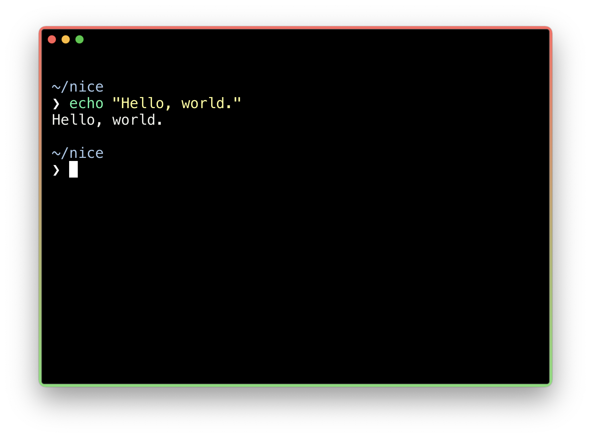
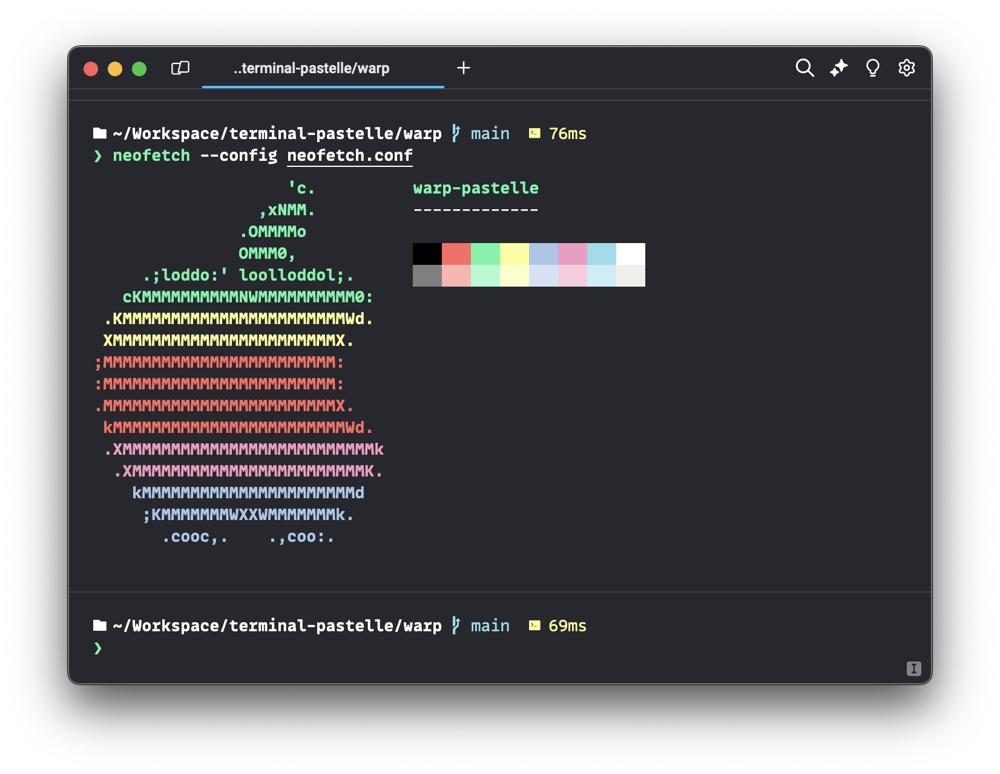

  <h1>terminal-pastelle</h1>
  
A nice pastel-type theme for a variety of terminals.

  <a href="https://github.com/dilanx/terminal-pastelle/tree/main/hyper"><h2>Hyper</h2></a>
  

  <a href="https://github.com/dilanx/terminal-pastelle/tree/main/warp"><h2>Warp</h2></a>
  

