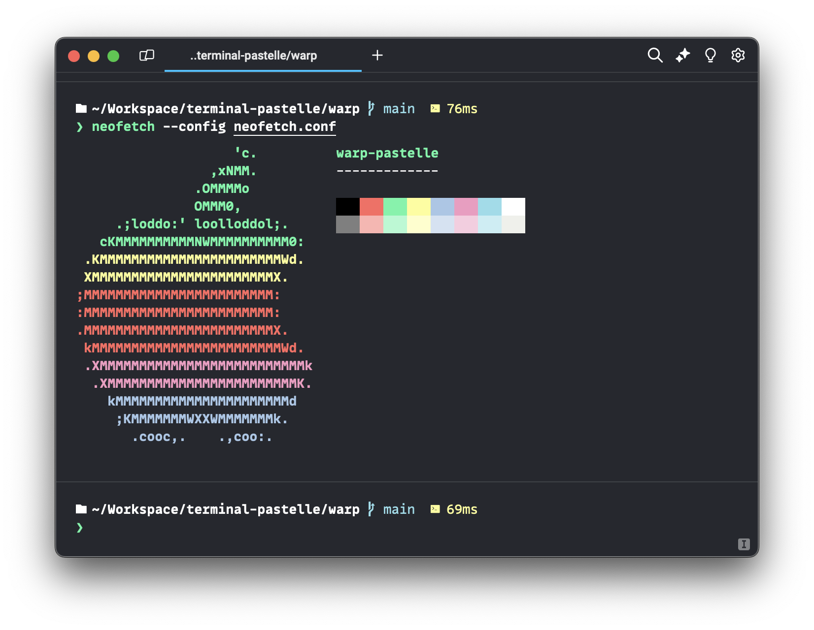

# warp-pastelle
A nice pastel-type theme for the [Warp](https://www.warp.dev/) terminal.

## Installation

1. Download [warp_pastelle.yaml](warp_pastelle.yaml)
2. Place the theme file in `~/.warp/themes/`
3. Enable the theme in Warp using the theme picker
